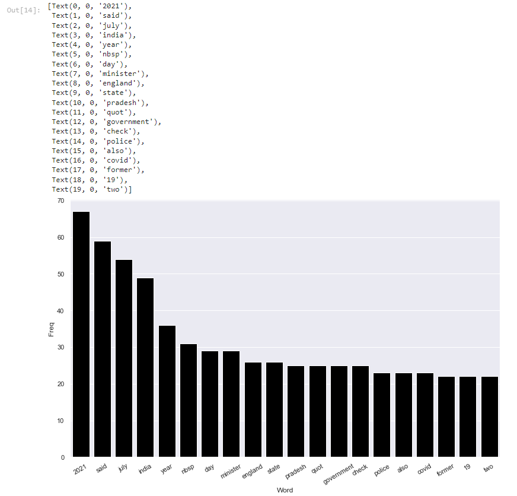
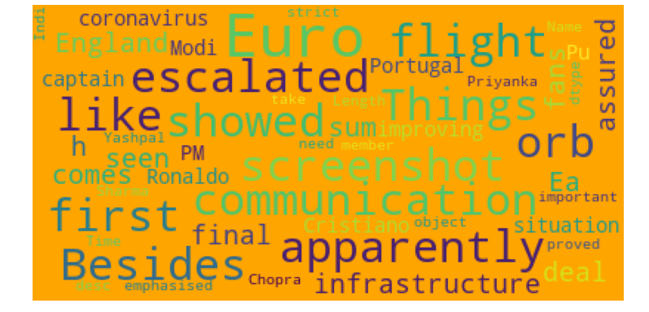
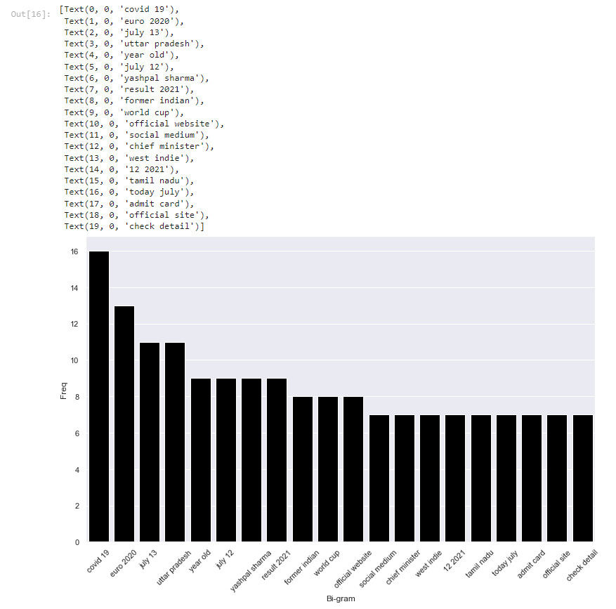
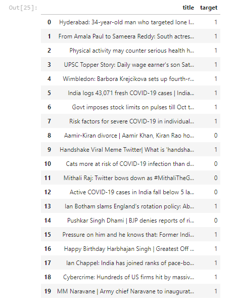

# trending-news-prediction

**Problem Statement:**
The Objective is to scrape news data from a website (https://www.timesnownews.com/) using a custom crawler script and train a model using the scraped news dataset to accurately classify an new instance of news article as trending or non-trending.

**Solution:** 
**Custom Crawler Script:**
A custom crawler script written using requests, re and pandas module to scrape trending and non-trending news from the 'times now news' website and stored as seperate csv files.

Primarily this is a classification task, few machine learning algorithms were fitted for the use case. The jupyter notbook in the repository would explain my solution in detail to fit the models to identify and classify the instances as trending ir non-trending.

1) **Training data preparation:** The dataset created from the web crawler are imported as data frames. The target labels are added following by dropping the duplicates.
The datasets are subjected to random shuffling to reduce bias and variance.
2) **Sanitizing the datasets:** The nltk module is used to ensure stopwords such as "the,a,an,is.." are removed along with special characters.
3) **Document-Term Matrix:** A document-term matrix is a mathematical matrix that describes the frequency of terms that occur in a collection of documents. In a document-term matrix, rows correspond to documents in the collection and columns correspond to terms.
We combine the train and test datasets to obtain a DTM which is used for Exploratory data analysis.
4) **Exploratory Data Analysis:** <ul><li>We check the top single words repeating in the dataset.   </li><li>Build a wordcloud for the same.   </li><li>We check the top bi-gram(two word) words repeating in the dataset.   </li></ul>
5) **Data Preprocessing:** Splitting the Dcoument term matrix dataset built in step 3) with a split of 80:20 using the test train split module.
6) **Model**: Comparing the following Machine Learning models for the use case:<ul><li>LogisticRegression</li><li>KNeighborsClassifier</li><li>DecisionTreeClassifier</li><li>RandomForestClassifier</li><li>XGBClassifier</li></ul>  Choosing the **Logistic regression classifier** as it was able to train with the highest accuracy.
7) **Inferences:** <ul><li>From the results, we can observe that the any news related to COVID-19 is tagged as Trending which is true considering the pandemic.</li><li>Another observation from the prediction table is that the word Viral (or Trending) in the title also contributes a lot for news article to trend on social media or news websites.</li><li>Cricket sport in India has huge following which is also reflected in prediction table.</li></ul>  
